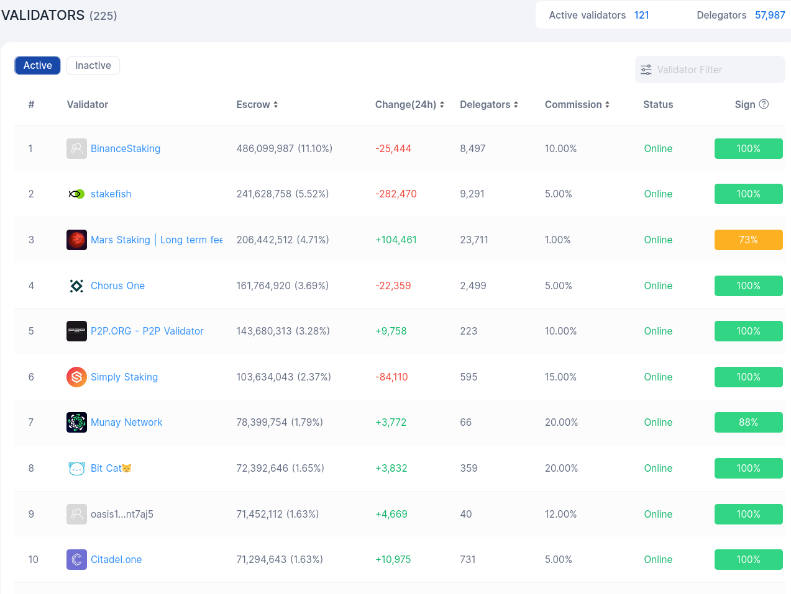

# Staking and Delegating

The Oasis Network is a proof-of-stake network. This means that the **voting
power of an entity in the network is determined by the amount of tokens staked
to that entity**. For example, this amount determines, how frequent the
validator will be elected to propose a new block. Each epoch, the staking
reward is distributed among the validators based on the amount of *staked*
tokens. You can check out the **current staking rewards** in the [Token metrics
chapter][current staking rewards].

But it's not just the validators that can stake. You can *delegate* your tokens
to a validator and earn **passive income**, when the validator receives the
staking reward. Of course, the validator may take their cut (the *commission
fee*) for running the validator node hardware, but in essence staking **improves
the security of the network** because paying the commission fee rewards good
validators and expels the malicious ones. Keep in mind that the validator's
misbehavior **will result in _slashing_** or even **losing a portion of the
staked tokens**!

[current staking rewards]: ../oasis-network/token-metrics-and-distribution.mdx#staking-incentives

When you undelegate your tokens, you will need to wait the **debonding period**
to pass in which you will not earn any rewards. Currently, this period is **336
epochs (~14 days)**.

## How to Delegate?

Staking can only be performed on the **consensus layer**. Currently, the Oasis
Wallet - Web and the Browser extension require that you delegate your tokens
explicitly from your consensus account. The Oasis CLI and some dApps running in
ParaTimes also allow you to implicitly delegate tokens from your ParaTime
account.

Check out the current validator set, their escrow of staked tokens, the
commission rate, and the availability in the [Oasis Scan explorer][explorer-validators].

:::info

Some validators prefer anonymity and they do not list their name or any contact
information. In this case only their entity's Oasis address is shown.

:::

Regardless of which validator you pick, **you will earn the same reward as long
as the validator is online, proposes and signs valid blocks**. We recommend
that you consider delegating your tokens to the ones without the largest
delegations since this **concentrates the voting power and potentially reduces
the network security**.

Once you decided which validator you want to delegate to, consult the following
sections based on your wallet for a step-by-step walkthrough:

* [Oasis Wallet - Web](oasis-wallets/web.mdx#stake)
* [Oasis Wallet - Browser Extension](oasis-wallets/browser-extension.mdx#stake)
* [Oasis CLI](cli/account.md#delegate)

:::danger Staking your ROSE is a different transaction than sending them!

When you stake your tokens (the `staking.Escrow` transaction), you can reclaim
them at any time. Sending your tokens (the `staking.Transfer` transaction) on the
other hand means that the **receiver will own the tokens and there is no way of
retrieving that tokens back by yourself**.

If you happen to send your tokens to the validator instead of staking them, try
contacting the validator via email or other channels listed on the block
explorers and kindly ask them to send the tokens back to you. Know that it is
completely up to them to send the tokens back and there is no other mechanism of
doing it.

:::

After you delegated your tokens, [check your account balance][check-account].
If the Escrow is correct, then congratulations, your tokens are successfully
staked!

:::tip

Some custody providers may also allow delegation of your tokens. Check out the
[custody providers][custody-providers] chapter to learn more.

:::

[check-account]: ./README.mdx#check-your-account
[explorer-validators]: https://www.oasisscan.com/validators

## Become a validator yourself?

If you find the validator commission rates too high, you may be interested in
**running your own node and become a validator**. You can get started
[here](../../node/README.mdx). Be sure to
[join the **#node-operators** channel on Discord and sign up for the node operator mailing list](../../get-involved/README.md)!

